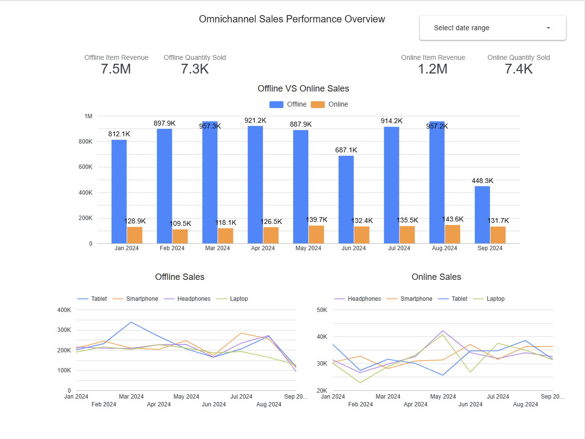
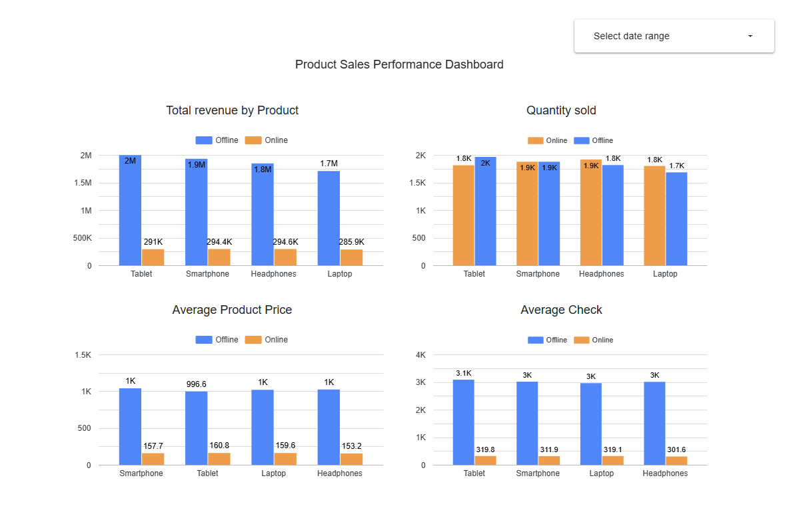
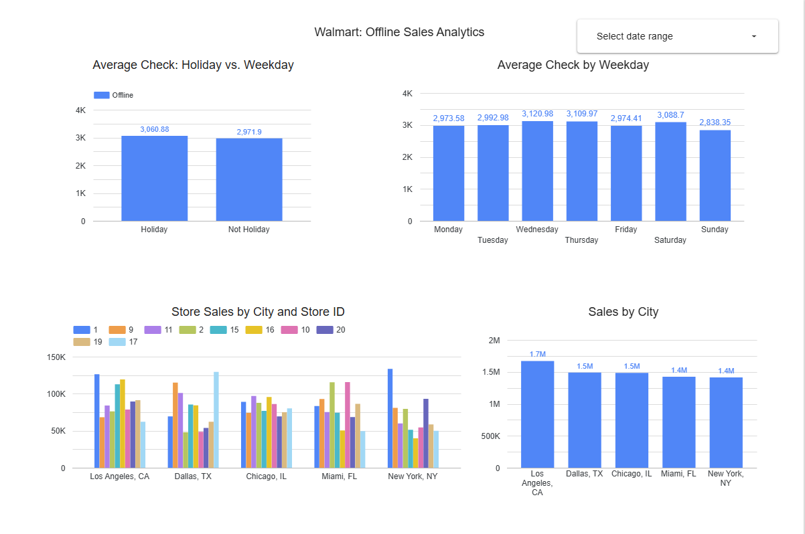

# Omnichannel Sales Insights (Shopify + Walmart)

## Project Objective
Unify and analyze sales from **offline (Walmart)** and **online (Shopify)** channels to compare performance across the same four product families: **Laptops, Tablets, Smartphones, Headphones**. 
Dashboards focus on **Jan–Sep 2024** to match the coverage of Walmart’s offline dataset.

---

## 1) Omnichannel Performance Overview

**Key KPIs (Jan–Sep 2024):**
- **Offline revenue:** **$7.5M** with **7.3K** units  
- **Online revenue:** **$1.2M** with **7.4K** units

**Monthly trends:**  
Offline peaks in **March** and **August**, dips in **June**. September appears low due to partial data (through Sep 16).  
Online peaks in **August** and **May**, lowest in **February**.

---

## 2) Product Performance Deep-Dive

Despite similar unit volumes, revenue differs by **>6×**. The driver is **price**:  
- **Offline average price:** ≈ **$996–$1,038** per unit (across all four categories)  
- **Online average price:** ≈ **$154–$159** per unit

---

## 3) Walmart Offline Analytics (2024)

- **Average check**: Only **~3%** higher on holidays vs. weekdays; weekday variance is minimal (slight uptick Wed/Thu/Sat).
- **City-level sales**: Fairly uniform, with **Los Angeles** slightly leading in total revenue.
- **Store variance**: **Store ID 1 (NYC)** delivers ~**$133.5K** profit vs. **Store ID 16 (NYC)** just under **$40K**, a **3×** gap.
- Dataset covers **full-year 2024** for offline analysis.

---

## Key Insights

- **Revenue gap is pricing-driven**: Similar units (7.4K online vs. 7.3K offline) but **>6×** revenue difference due to average price levels.
- **Mixed seasonality**: Channel peaks occur in different months (Offline: Mar/Aug; Online: Aug/May).
- **Operational spread**: Material efficiency differences between stores—opportunity to replicate high-performer practices.

---

## Recommendations

1. **Audit pricing strategy** across channels; test scenarios for online price uplift vs. potential unit elasticity.
2. **Benchmark stores**: Compare processes at Store ID 1 vs. Store ID 16 to identify replicable drivers (staffing, layout, local promotions).
3. **Track month-over-month levers** (promotions, inventory, weather, holidays) to explain peaks/dips and inform planning.
4. **Standardize reporting cadence**: Use the dashboards to monitor price, margin, and unit mix routinely.

---

### Notes
- Time window aligned to **Jan–Sep 2024** where both channels overlap.  
- Online/Offline color coding and product colors have been standardized (see palette guide).

